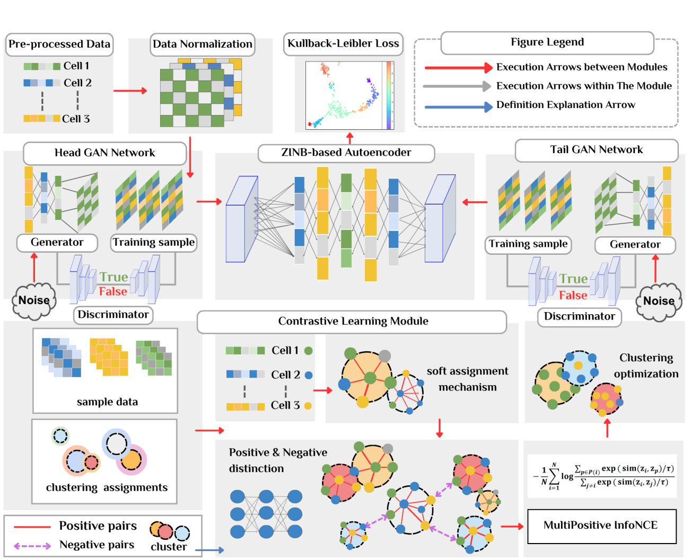

# DGAN-MPCC：双生成对抗网络增强的多正样本对比聚类方法

## 摘要
人工智能驱动的聚类方法极大提升了研究者探索单细胞组学数据内在异质性的能力，这对于理解复杂的生物医学系统至关重要。尽管已有诸多进展，现有的方法仍面临两大挑战：  
(1) 单细胞数据天然稀疏且噪声大，容易导致网络过拟合。已有研究尝试使用生成对抗网络（GAN）进行数据增强，但传统单GAN结构主要聚焦于简单的数据扩充，难以推断复杂的生物学规律，导致聚类性能不佳。  
(2) 对比学习虽能获得高质量聚类结构，但现有方法大多只依赖单一正样本对，无法建模细胞状态的连续过渡，从而阻碍构建对细胞类型敏感的特征表示。

为此，我们提出了一种专为低质量单细胞数据设计的**双GAN增强多正样本对比聚类方法（DGAN-MPCC）**。核心创新包括：  
- 使用**两个独立的GAN**同时对输入层和瓶颈层进行数据质量增强，显著提升生成的细胞嵌入质量；  
- 设计了**多正样本对比聚类框架**，根据当前聚类结构自适应地定义多正样本集合，使每个样本与其同簇内所有样本建立正样本关系，大幅丰富同类内的监督信号。  

在多个真实单细胞数据集上的广泛实验表明，DGAN-MPCC在各种场景下均超越现有最先进方法，为医疗健康领域的人工智能决策提供了更鲁棒、更高效的工具。

## 模型架构（主要模块）
DGAN-MPCC框架包含以下核心组成部分：  
1. **Head GAN 网络**：在编码前对原始输入数据进行质量增强（去噪+补全）  
2. **基于ZINB的自编码器**：核心特征提取与降维模块  
3. **Tail GAN 网络**：在编码后对瓶颈层（潜在表示）进行质量增强  
4. **多正样本对比学习模块**：使用MultiPositive InfoNCE损失进行自适应聚类优化  

## 关键特性
- **双GAN架构**：前后两段独立GAN，分别对输入端和潜在空间进行增强  
- **多正样本对比学习**：根据当前聚类结果自适应构建多正样本集合  
- **ZINB损失**：专为单细胞数据高度稀疏性设计的Zero-Inflated Negative Binomial重建损失  
- **鲁棒聚类**：在低质量单细胞组学数据上表现显著优于现有方法  

## 文件结构
- `mymodel_new_v2_formal.py`：主模型实现文件  
- `gan_models.py`：生成器与判别器网络结构  
- `contrastive_loss.py`：多正样本对比损失实现  
- `zinb_loss.py`：ZINB损失函数实现  
- `layers.py`：自定义神经网络层  
- `preprocess.py`：数据预处理工具  
- `evaluation.py`：聚类评估指标  
- `klug/`：示例数据集  

## 环境依赖
- Python 3.x  
- PyTorch  
- NumPy  
- scikit-learn  
- scanpy  
- pandas  

## 使用方法
[待补充使用说明]

## 引用信息
[待补充引用格式]

## License

[Add license information here]

